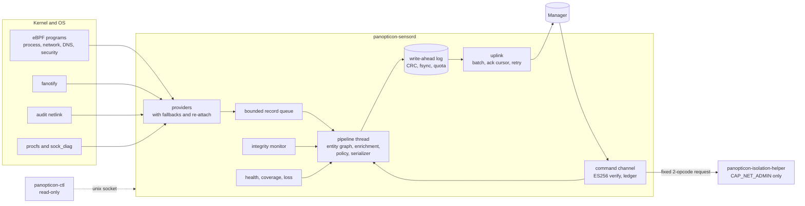
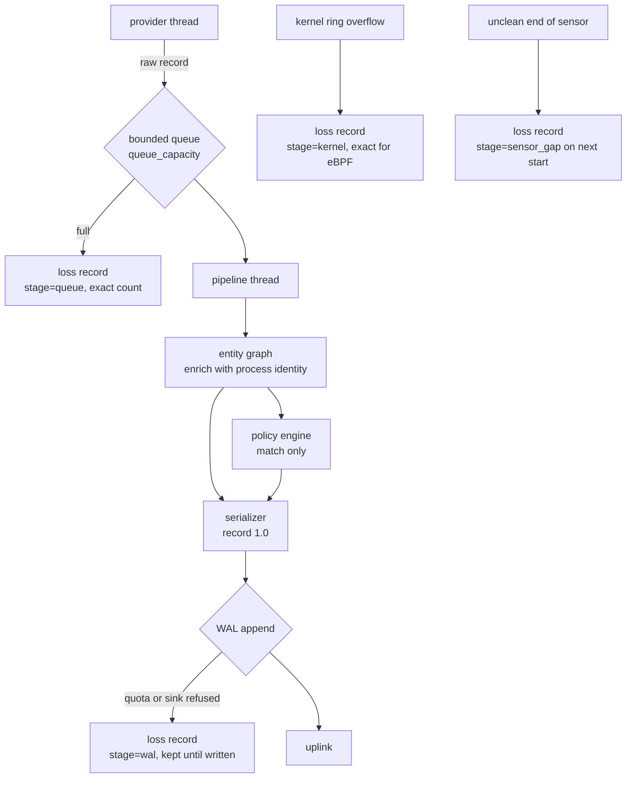
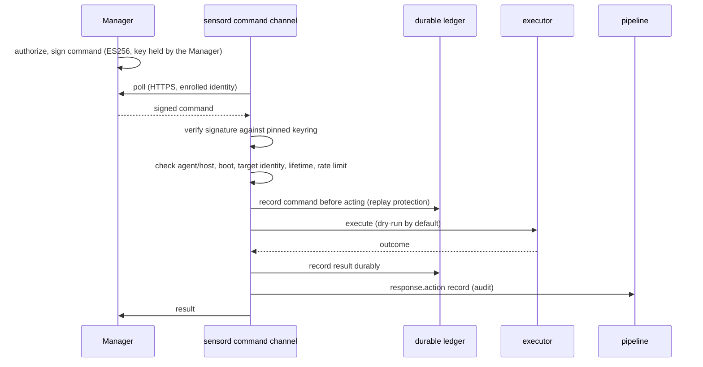
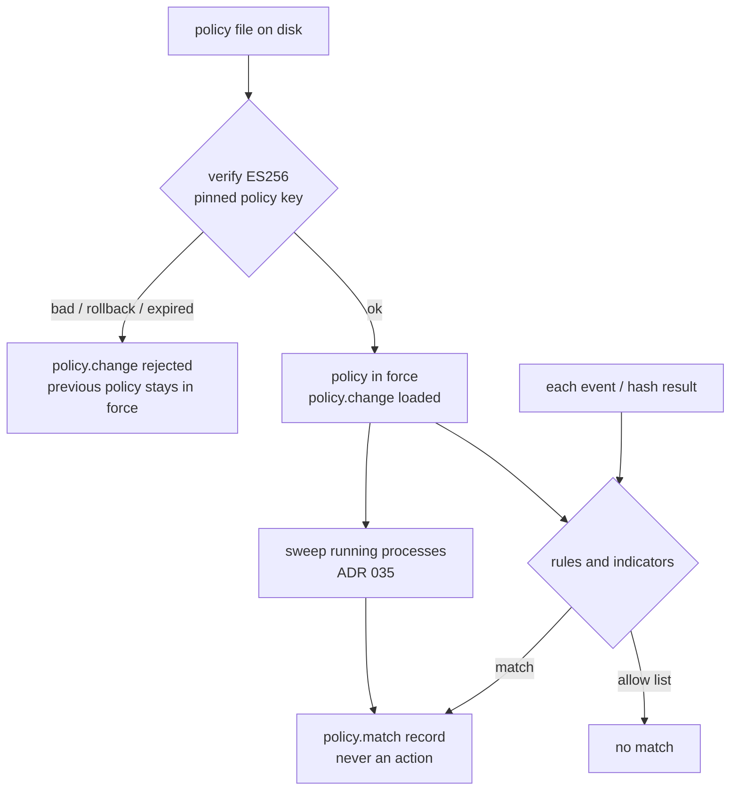
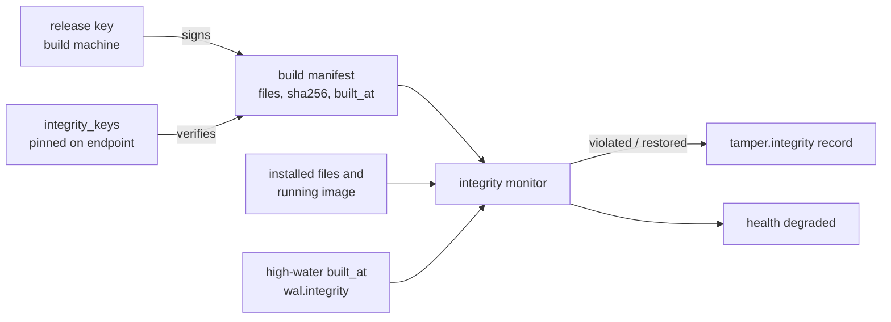
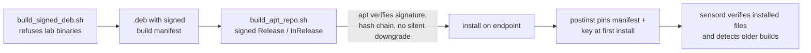
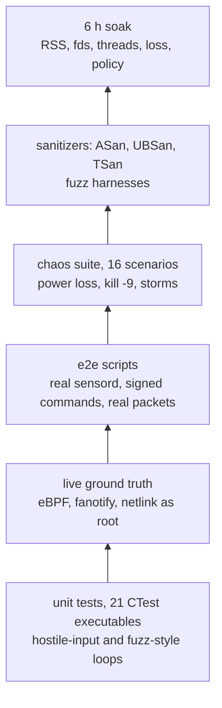

# Panopticon Linux Agent

The Linux endpoint for [Panopticon](https://github.com/Panopticon-Co), an EDR/XDR capstone platform. It is a
resident C++20 sensor (`panopticon-sensord`) that collects kernel-level telemetry on a Linux host, keeps it
durably, delivers it to the Panopticon Manager with at-least-once semantics, applies a signed local policy, runs
a small set of signed and audited response actions, and monitors its own installation for tampering.

> **Scope and honesty.** This is a capstone project. The current Linux endpoint implementation is validated on
> exactly one platform: **Ubuntu 22.04, kernel 5.15, x86_64**, in a VM. It is not claimed to be production-ready.
> Each statement below is labelled with how far it has been checked (see [Validation labels](#validation-labels)),
> and [Known limitations](#16-known-limitations) lists what is missing. For a maintainer taking over, start with
> [docs/HANDOFF.md](docs/HANDOFF.md).

## Contents

1. [Overview](#1-overview) · 2. [Architecture](#2-architecture) · 3. [Responsibilities](#3-linux-agent-responsibilities) ·
4. [Telemetry](#4-telemetry) · 5. [Event pipeline](#5-event-pipeline) · 6. [WAL and durability](#6-wal-and-durability) ·
7. [Command and response plane](#7-command-and-response-plane) · 8. [Security model](#8-security-model) ·
9. [Policy engine](#9-policy-engine) · 10. [Integrity and tamper detection](#10-integrity-and-tamper-detection) ·
11. [Package and update security](#11-package-and-update-security) · 12. [Reliability](#12-reliability) ·
13. [Performance](#13-performance) · 14. [Testing](#14-testing) · 15. [Current validation status](#15-current-validation-status) ·
16. [Known limitations](#16-known-limitations) · 17. [Development setup](#17-development-setup) ·
18. [Running the agent](#18-running-the-agent) · 19. [Running tests](#19-running-tests) · 20. [VM validation](#20-vm-validation) ·
21. [Repository structure](#21-repository-structure) · 22. [Future work and handoff notes](#22-future-work-and-handoff-notes)

## Validation labels

Used throughout this repository. A label is only as strong as the evidence named next to it.

| Label | Meaning |
| --- | --- |
| **IMPLEMENTED** | The code exists on this branch. Says nothing about whether it works. |
| **UNIT TESTED** | Covered by an automated test in `tests/` that runs without a real kernel feature. |
| **REAL-VM VERIFIED** | Observed working on the Ubuntu 22.04 / 5.15 / x86_64 validation VM, with a real kernel, real processes and a script that can be re-run. |
| **SUSTAINED-LOAD VERIFIED** | Held up under a long or heavy run (soak, storm, chaos, sanitizer campaign). |
| **VALIDATION PENDING** | Implemented; the real run has not happened yet. The exact command is documented. |
| **NOT IMPLEMENTED / OUT OF SCOPE** | Does not exist, or deliberately excluded. |

## 1. Overview

```text
kernel (eBPF, fanotify, audit, netlink, procfs) ──> panopticon-sensord ──> WAL on disk ──HTTPS──> Manager
                                                       │   ▲                                         │
                                       signed local policy │ signed commands (ES256) <───────────────┘
                                       self-integrity      │ audited results (response.action records)
```

* The sensor is an **endpoint executor and telemetry source**. It does not decide what is malicious beyond a
  signed local policy that can only raise `policy.match` records; detection, correlation and authorization of
  response live in other Panopticon repositories.
* It emits one strict record format, **Linux endpoint record 1.0**, defined in
  [panopticon-contracts](https://github.com/Panopticon-Co/panopticon-contracts)
  (`schema/linux-endpoint/1.0.schema.json`, branch `feat/linux-endpoint-record`).
* Everything it cannot see or had to drop is **said explicitly** in the stream (loss, gap, unavailable and
  health records) instead of being silent.

Two binaries from earlier phases are still built and unchanged in role: `panopticon-linux-agent` (the original
procfs/Schema 0.4 agent and its closed seven-action response library, [RESPONSE.md](RESPONSE.md)) and
`panopticon-isolation-helper` (the privilege-separated nftables helper, [ADR 004](docs/adr/004-host-isolation-privilege-boundary.md)).
`panopticon-sensord` is the current Linux endpoint implementation and reuses both.

## 2. Architecture



Design properties that matter when changing the code:

* The **pipeline is single-threaded by design**: the entity graph and sequence numbers are mutated in one place.
  Providers run on their own threads and hand records over through a bounded queue.
* **`seq` is contiguous per sensor stream.** Any hole must be explained by a `loss` record. This invariant is what
  the chaos and soak tests check ([tests/chaos/analyze.py](tests/chaos/analyze.py)).
* **Privilege separation:** the sensor never holds `CAP_NET_ADMIN` for response; isolation goes through a minimal
  helper over an `AF_UNIX SOCK_SEQPACKET` socket with fixed opcodes.
* **Fail-safe policy and command handling:** a bad update leaves the previous state in force; a refused command is
  recorded, never executed.

Deeper description: [docs/endpoint/LINUX_ENDPOINT_ARCHITECTURE.md](docs/endpoint/LINUX_ENDPOINT_ARCHITECTURE.md)
(a design document that mixes built and planned parts; [docs/endpoint/IMPLEMENTATION_STATUS.md](docs/endpoint/IMPLEMENTATION_STATUS.md)
says which is which) and the 36 [ADRs](docs/adr/).

## 3. Linux agent responsibilities

| Responsibility | Component | Notes |
| --- | --- | --- |
| Collect telemetry | providers (`ebpf_process`, `ebpf_network`, `ebpf_security`, `fanotify_file`, `sensitive_file`, `audit_netlink`, `kernel_change`, plus standby `netlink_proc`, `sockdiag_network`, `auth_log`) | Primary/fallback tiers; the health record names the active one and why |
| Keep process identity | entity graph | Boot-scoped entity ids, PID-reuse detection, exec generations |
| Make records durable | WAL | CRC-checked segments, fsync policy, byte quota, accounted drops |
| Deliver | uplink | At-least-once, cursor moves only on a matching acknowledgement |
| Report state | host-state engine | `state.*` inventories (host, posture, users, groups, interfaces, mounts, modules, persistence, processes) |
| Apply local policy | policy engine | Signed bundles; decisions and matches only, **never actions** |
| Execute response | command channel + response library | Signed, audited, dry-run by default |
| Protect itself | integrity monitor, trusted-path checks | Detection and evidence; see [Known limitations](#16-known-limitations) |
| Say what it cannot do | health, coverage, loss records | Never silent |

## 4. Telemetry

Record types written today (field-level detail: [LINUX_ENDPOINT_TELEMETRY_CATALOG.md](docs/endpoint/LINUX_ENDPOINT_TELEMETRY_CATALOG.md)).
Status is on Ubuntu 22.04 / 5.15 / x86_64 only.

| Family | Record types | Source | Status |
| --- | --- | --- | --- |
| Process | `process.fork`, `.exec` (argv, exe, cwd, creds, caps, namespaces, cgroup, container, stdio, interpreter), `.exit`, `.rename`, `.cred_change`, `.ns_change`, `.signal`, `.discovered` | eBPF tracepoints/fentry, procfs reconcile | REAL-VM VERIFIED (`panopticon-ebpf-tests`, live ground truth) |
| Memory / kernel | `memory.exec_mapping`, `kernel.bpf_load`, `kernel.module_load/unload`, `mount.changed` | eBPF fentry, `/proc` diff | REAL-VM VERIFIED |
| File | `file.create/modify/delete/rename/attrib`, `file.open_sensitive`, `fim.baseline/changed`, `hash.computed` | fanotify, FIM scan, hash worker | REAL-VM VERIFIED |
| Network | `network.connect/accept/listen/close`, `network.raw_socket`, `dns.query` | eBPF fentry, sock_diag fallback | REAL-VM VERIFIED (5.15 only; see limitation on 6.x) |
| Auth | `auth.login/failure/privilege` | audit netlink, auth log fallback | PARTIAL: SSH/sudo/su verified; PAM-config and account changes not covered |
| Security | `lsm.denial`, `lsm.policy`, `netfilter.config_change` | audit netlink | REAL-VM VERIFIED for AppArmor and nftables; SELinux parsed, not verified |
| Containers | `container.started/stopped`, container id on process records | cgroup path parsing | REAL-VM VERIFIED with docker; podman/CRI-O/Kubernetes by unit tests only |
| Host state | `state.host`, `.posture`, `.users`, `.groups`, `.interfaces`, `.mounts`, `.modules`, `.persistence`, `.processes`, `.connections` | procfs/sysfs collectors | REAL-VM VERIFIED (partial inventory; no OS release or hardware inventory) |
| Policy and response | `policy.match`, `policy.change`, `response.action` | policy engine, command processor | REAL-VM VERIFIED |
| Self | `tamper.integrity`, `health`, `loss` | integrity monitor, pipeline | REAL-VM VERIFIED (`tamper.integrity`); package path VALIDATION PENDING |

Not collected (see [Known limitations](#16-known-limitations)): package install events and software inventory, shared
library loads, `ptrace`/`process_vm_writev` injection, interface and route changes, USB, log tampering,
cloud identity, io_uring, and file-write content.

## 5. Event pipeline



Every place a record can be refused has a counter that something reads and turns into a `loss` record
(`kernel`, `queue`, `governor`, `wal`, `refused`, `sensor_gap`, Manager-rejected quarantine). Finding and closing
the ones that were silent is documented in [IMPLEMENTATION_STATUS.md](docs/endpoint/IMPLEMENTATION_STATUS.md)
(S11.1, S13.9, S13.10, S13.21).

## 6. WAL and durability

* Append-only segments with a CRC-32C per frame, contiguous sequence numbers, and `fdatasync` on a byte/time
  trigger ([ADR 008](docs/adr/008-write-ahead-log-and-acknowledged-delivery.md)). A byte quota bounds disk use;
  records dropped to stay inside it are counted and reported.
* The WAL verifies its own storage once a second and recovers from deleted segments or a deleted directory,
  reporting what was lost ([ADR 030](docs/adr/030-wal-runtime-integrity.md)).
* An instance marker (`<wal>.instance`) lets the next start report an unclean end as a `sensor_gap`.
* Delivery is at-least-once with a durable cursor ([ADR 018](docs/adr/018-uplink-and-cursor-semantics.md)); the
  Manager de-duplicates by `(stream, seq)`.
* Evidence: 14 `kill -9` restarts with no loss and 14 gaps reported; two VM power-loss crashes in which every
  sequence the sensor had reported durable was present after restart (S11.2). These are REAL-VM VERIFIED; no
  torn-sector test was done.

## 7. Command and response plane



| Action | What it does | Safety properties |
| --- | --- | --- |
| `KILL_PROCESS` | pidfd-bound termination | Identity (pid + start time) re-checked at the pidfd; protected set; dry-run default |
| `COLLECT_PROCESS_INFO` | Forensic snapshot of one process | Read-only |
| `COLLECT_NETWORK_CONNECTIONS` | Socket table with owning pid, emitted as `state.connections` | Read-only |
| `COLLECT_FILE` | Hash and metadata of a file | Descriptor-based, root-jailed, size-bounded |
| `QUARANTINE_FILE` | Move into a 0700 store | `renameat2(NOREPLACE)`, inode check, quotas, dry-run |
| `ISOLATE_HOST` / `RELEASE_HOST_ISOLATION` | Fixed nftables ruleset via the helper | Two fixed opcodes; the Manager path stays open; outcomes say what is *known* |

Facts a maintainer must keep true ([ADR 024](docs/adr/024-command-channel.md), [025](docs/adr/025-command-authorization.md),
[026](docs/adr/026-file-actions.md), [027](docs/adr/027-host-isolation-command-wiring.md), [028](docs/adr/028-command-channel-resilience.md), [034](docs/adr/034-no-unsigned-commands-in-packaged-builds.md)):

* Enforcement requires **pinned signing keys**. A packaged build **cannot** be configured to trust unsigned
  commands; that option exists only in a lab build (`-DPANOPTICON_LAB_UNSIGNED_COMMANDS=ON`).
* Detection and policy code never call the executor. Response is a separate, authenticated path.
* Remediation defaults to **dry run**. Real kill/quarantine/isolation run only in sacrificial test setups.
* Evidence: `run_command_auth_e2e.sh` (51 checks), `run_command_chaos_e2e.sh` (56 checks), and
  `run_isolation_command_e2e.sh` (26 checks, real packets between network namespaces) all passed on the VM.
  After ADR 034 changed scenario 7 of the first one, it has **not been re-run** (see [Current validation status](#15-current-validation-status)).

## 8. Security model

Full threat table: [docs/endpoint/LINUX_ENDPOINT_SECURITY_MODEL.md](docs/endpoint/LINUX_ENDPOINT_SECURITY_MODEL.md).
Key custody: [docs/endpoint/LINUX_ENDPOINT_KEY_CUSTODY.md](docs/endpoint/LINUX_ENDPOINT_KEY_CUSTODY.md).

| Control | Mechanism | Status |
| --- | --- | --- |
| Command authenticity | Per-command ES256, pinned and revocable keyring, signature checked before any other decision | REAL-VM VERIFIED |
| Command replay / retargeting | Durable ledger, boot and start-time binding, lifetimes, rate limit | REAL-VM VERIFIED, chaos-tested |
| Policy authenticity | Signed bundle, separate keyring, monotonic version, expiry, key revocation | UNIT TESTED; REAL-VM VERIFIED (policy sweep e2e); soak workload running |
| Trusted configuration | Config, CA bundle and key lists must be regular files owned by root/sensor, not group/world writable, in non-writable directories ([ADR 031](docs/adr/031-trusted-configuration-and-service-unit.md)) | UNIT TESTED |
| Binary / install integrity | Signed build manifest, running-image hash, `tamper.integrity` | REAL-VM VERIFIED (26 checks); signed package path VALIDATION PENDING |
| Rollback detection | Signed `built_at` high-water mark | REAL-VM VERIFIED (integrity e2e scenario 8) |
| No unsigned-command path in packages | Compiled out; refusal string checked at package build | UNIT TESTED; refusal observed on a real sensord |
| Privilege separation | Isolation only via the minimal helper | REAL-VM VERIFIED |
| Hardened service | systemd sandboxing, bounded capabilities | REAL-VM VERIFIED install; no independent security review or penetration test |

**The honest limit:** the pinned keys, the manifest and the sensor live on the same host. A root attacker who
replaces the binary can also replace the keys and manifest. The integrity and rollback features make casual or
partial tampering noisy and attributable; they are not a defence against a careful root attacker. There is no
secure-boot/IMA/TPM anchor.

## 9. Policy engine



Rules match on events (`process.exec`, `dns.query`, `file.*`, hashes) using regex-free operators, indicator sets and an
allow list, with bounded decisions. A policy that comes into force is also applied to processes **already
running** (bounded: 1,024 matches, 2,048 image hashes, and the limit is reported).
References: [ADR 016](docs/adr/016-local-policy-engine.md), [032](docs/adr/032-signed-local-policy.md), [035](docs/adr/035-policy-sweep-of-running-processes.md).
Prevention (blocking execution) is **not implemented**.

## 10. Integrity and tamper detection

The sensor checks every file in a signed build manifest and its own running image, reports confirmed findings
(two looks, except at start) as `tamper.integrity` (`binary_modified`, `binary_missing`, `binary_replaced`,
`manifest_missing`, `manifest_invalid`, `manifest_rollback`), names the last writer when file events saw it, turns
health `degraded`, and reports `restored` when the condition clears.
([ADR 033](docs/adr/033-signed-build-manifest-and-self-integrity.md), [ADR 036](docs/adr/036-rollback-detection-by-build-time-high-water.md).)



A sensor that is killed reports nothing; the **next start** reports the blind interval as `sensor_gap`. `kill`
attempts against the sensor, BPF detach, and `ptrace` of the sensor are **not** reported as `tamper.*` records.

## 11. Package and update security



* `dpkg` does **not** verify a `.deb`'s own signature; the protection is the **signed apt repository** and apt's
  refusal to downgrade without `--allow-downgrades`.
* Status: the tooling is **IMPLEMENTED** and the manifest/rollback behaviour is REAL-VM VERIFIED by
  `run_integrity_e2e.sh`, but **the end-to-end package script `tests/e2e/run_package_e2e.sh` has not been run**
  (see [Current validation status](#15-current-validation-status)). Do not call the package/update path verified.
* No automatic update, no automatic rollback on a failed start, no RPM, no SBOM.

## 12. Reliability

| Property | Evidence | Label |
| --- | --- | --- |
| No silent loss across 16 chaos scenarios (outages, full disk, corrupted/deleted WAL, kill -9, slow/lossy Manager, ring overflow, memory cap, fd limit) | `tests/chaos/run_chaos.sh`: Release 16/16; ASan/UBSan 16/16 (with a larger memory envelope for the sanitizer) | REAL-VM VERIFIED |
| Provider hook loss is detected and re-attached | gdb-injected `close()` → `degraded` within 3 s (S13.14, S13.16) | REAL-VM VERIFIED |
| Crash / power loss | 14 kill -9; two power-loss crashes | REAL-VM VERIFIED |
| Thread-safety | Full ctest under ThreadSanitizer 20/20, 30-minute live run, 0 reports | SUSTAINED-LOAD VERIFIED (30 min) |
| Parser robustness | 16 libFuzzer harnesses, 900 s each, seeded corpora | SUSTAINED-LOAD VERIFIED (per campaign) |
| Long-duration stability | 6-hour Release soak | **VALIDATION PENDING** (running; see [HANDOFF](docs/HANDOFF.md#6-hour-soak-status)) |

## 13. Performance

Measured by us on the validation VM (Ubuntu 22.04, kernel 5.15, VirtualBox). Full tables, methods and caveats:
[docs/endpoint/LINUX_ENDPOINT_PERFORMANCE.md](docs/endpoint/LINUX_ENDPOINT_PERFORMANCE.md).

| Metric | Result | Label |
| --- | --- | --- |
| Idle CPU, wake-ups | 0.40 % of one core, 17.5 wake-ups/s (0.35 %, 20.5/s with a Manager) | MEASURED (S11.4) |
| Mean record size | 3.6 KB (process lifecycle ≈ 4.1 KB, file/network/DNS ≈ 2 KB, health 4.3 KB) | MEASURED (S11.3) |
| Hook overhead, 4 vCPUs online | exec −0.4 %, TCP loopback connect +5.1 %, open/close +1.3 %; sensor ≈ 10 % of one core, 55 MiB | MEASURED (S13.14); noisier on 8 vCPUs |
| Loss-free event rate | up to ≈ 12,000 network events/s; beyond that, the excess is shed and reported exactly | MEASURED (S13.9), single pipeline thread |
| Mixed-workload rate used for comparison | ≈ 150 events/s (153.5/s in the 30-minute ThreadSanitizer run; that run was ≈ 24 % of one core with TSan instrumentation, so it overstates a Release build) | MEASURED (S13.22) |
| Throughput ladder, queue depth, drain and recovery after overload | `tests/perf/ladder.py` | **NOT YET MEASURED** (harness written, run pending) |
| Kernel→WAL latency p99, host→Manager latency p95 | – | NOT YET MEASURED |

## 14. Testing



| Layer | Where | Run |
| --- | --- | --- |
| Unit and component | `tests/*.cpp`, 21 CTest targets | `ctest --test-dir build --output-on-failure` (some need root) |
| Live ground truth | `panopticon-ebpf-tests`, `panopticon-sensor-tests` | `sudo build/panopticon-ebpf-tests` |
| End-to-end | `tests/e2e/run_*_e2e.sh` | Each script documents its arguments; most need root and a disposable VM |
| Chaos | `tests/chaos/run_chaos.sh` | `sudo tests/chaos/run_chaos.sh [scenario ...]` |
| Fuzz | `tests/fuzz/run_fuzz.sh` | needs a clang build with `-DPANOPTICON_ENABLE_FUZZ=ON` (header of the script) |
| Performance | `tests/perf/*` | see [PERFORMANCE.md](docs/endpoint/LINUX_ENDPOINT_PERFORMANCE.md) |
| Soak | `tests/soak/soak.py` | `sudo tests/soak/run_soak.sh [hours] [work-dir]` |

[TESTING.md](TESTING.md) has the suite-by-suite description, the test plan is
[docs/endpoint/LINUX_ENDPOINT_TEST_PLAN.md](docs/endpoint/LINUX_ENDPOINT_TEST_PLAN.md).

## 15. Current validation status

The authoritative, dated record is [docs/endpoint/IMPLEMENTATION_STATUS.md](docs/endpoint/IMPLEMENTATION_STATUS.md).
Summary as of the handoff pass:

| Area | State |
| --- | --- |
| Telemetry providers on 5.15 | IMPLEMENTED + REAL-VM VERIFIED |
| WAL, uplink, loss accounting | IMPLEMENTED + REAL-VM VERIFIED + chaos (Release and ASan/UBSan) |
| Command plane | IMPLEMENTED + REAL-VM VERIFIED; `run_command_auth_e2e.sh` re-run after ADR 034 **pending** |
| Signed local policy and sweep | IMPLEMENTED + REAL-VM VERIFIED |
| Self-integrity and rollback detection | IMPLEMENTED + REAL-VM VERIFIED (integrity e2e) |
| Signed package / apt repository path | IMPLEMENTED — **VALIDATION PENDING** (`tests/e2e/run_package_e2e.sh` never run) |
| ThreadSanitizer | PASSED (ctest + 30 min live) before the policy-sweep and rollback additions; re-run pending |
| Long ASan/UBSan chaos | Full suite passed once; long repeat pending |
| 6-hour soak | **Pending.** See [docs/HANDOFF.md](docs/HANDOFF.md#6-hour-soak-status) for exact status |
| Performance ladder | Harness written, **run pending** |
| Other kernels, distros, ARM64, SELinux | Not tested / out of current scope |

## 16. Known limitations

* **One platform.** Ubuntu 22.04, kernel 5.15, x86_64. The eBPF network hooks are known to fail verifier checks on
  at least one 6.x kernel (the GitHub workflow runs on Ubuntu 24.04 and marks that step non-blocking). No ARM64,
  no other distribution, no SELinux host.
* **No prevention.** Nothing blocks execution or network traffic; BPF-LSM/fanotify-permission enforcement is not built.
* **Same-host trust anchors** (section 8). Key custody beyond a file is not designed; there is no remote key,
  HSM/TPM or secure-boot anchor, and no signed key-distribution message.
* **Tamper coverage is partial.** Binary/manifest/rollback only. Sensor kill, BPF detach, ptrace of the sensor and
  unit disable are not reported as `tamper.*`.
* **Package path unverified end to end**; no RPM; no SBOM; no automatic update.
* **Single pipeline thread** limits loss-free throughput to roughly 12,000 events/s on the test VM; queue depth is
  not exposed in health.
* **Telemetry gaps:** package events and inventory, library loads, injection (`ptrace`, `process_vm_writev`),
  interface/route changes, USB, log tampering, OS release and hardware inventory, cloud identity.
* **Transport:** no certificate pinning; no compression (measured gain, Manager route does not accept it).
* **Not integrated with the Detection Engine.** Intentionally deferred; the endpoint is meant to stay independently
  mature first.

## 17. Development setup

Validated toolchain: Ubuntu 22.04, GCC 11.4, CMake 3.22, Clang 14 (sanitizers, fuzz, BPF objects).

```bash
sudo apt-get install -y build-essential cmake ninja-build pkg-config git clang llvm lld \
  libelf-dev zlib1g-dev libzstd-dev libcurl4-openssl-dev libssl-dev libmnl-dev libnftnl-dev \
  libsystemd-dev libcap-dev libseccomp-dev libpam0g-dev libaudit-dev python3-jsonschema \
  bpftrace linux-tools-$(uname -r) dpkg-dev fakeroot
git clone --recurse-submodules https://github.com/Panopticon-Co/panopticon-linux-agent.git
cd panopticon-linux-agent
git submodule update --init            # third_party/libbpf
cmake -S . -B build -G Ninja -DCMAKE_BUILD_TYPE=Release
cmake --build build --parallel
```

Build variants: `-DPANOPTICON_ENABLE_ASAN=ON -DPANOPTICON_ENABLE_UBSAN=ON`, `-DPANOPTICON_ENABLE_TSAN=ON`,
`-DPANOPTICON_ENABLE_FUZZ=ON`, and `-DPANOPTICON_LAB_UNSIGNED_COMMANDS=ON` (lab only; never package it). The
reproducible VM (Vagrant, VirtualBox, 8 vCPU / 6 GB) is described in [docs/HANDOFF.md](docs/HANDOFF.md#vm-setup).
More: [BUILD.md](BUILD.md), [CONTRIBUTING.md](CONTRIBUTING.md).

## 18. Running the agent

```bash
# Collection only, records to stdout (needs root for eBPF; --no-ebpf uses the fallbacks):
sudo build/panopticon-sensord --stdout --duration 30

# With a WAL and a control socket (configuration reference:
# docs/endpoint/LINUX_ENDPOINT_CONFIGURATION.md, example: packaging/sensord.conf.example):
sudo build/panopticon-sensord --config /etc/panopticon/sensord.conf --control-socket /run/panopticon/sensord.sock

# Read-only inspection from another shell:
build/panopticon-ctl --socket /run/panopticon/sensord.sock status
build/panopticon-ctl --socket /run/panopticon/sensord.sock coverage
build/panopticon-ctl --socket /run/panopticon/sensord.sock state list
```

Configuration is strict: unknown or duplicate keys stop the sensor from starting. Delivery to a Manager needs
`manager_url`, `identity_path` and `ca_bundle` together; commands need `response_signing_keys`; policy needs
`policy_path` and `policy_signing_keys`; integrity needs `integrity_manifest` and `integrity_keys`.

## 19. Running tests

```bash
ctest --test-dir build --output-on-failure -j1          # 21 targets; run as root for the live ones
sudo build/panopticon-ebpf-tests                         # live eBPF ground truth
sudo tests/chaos/run_chaos.sh                            # 16 scenarios (read the header for variables)
sudo tests/e2e/run_integrity_e2e.sh                      # integrity + rollback (see the script header)
sudo tests/e2e/run_policy_sweep_e2e.sh
sudo tests/e2e/run_command_auth_e2e.sh
```

Do not run e2e or chaos scripts on a machine you care about: several start and stop sensors, kill sacrificial
processes and fill disks inside a private directory. Several of them (and `run_soak.sh`) stop sensors by process
name, so never run them on a VM that is running a soak.

## 20. VM validation

All real-kernel validation ran on one Vagrant/VirtualBox VM (`generic/ubuntu2204`, kernel 5.15.0-91, 8 vCPU, 6 GB).
The Vagrantfile and sync procedure are in [docs/HANDOFF.md](docs/HANDOFF.md#vm-setup). `docs/VM_VALIDATION_GAPS.md`
lists what CI proves versus what needs a VM.

## 21. Repository structure

```text
include/panopticon/linux_agent/   public headers (core library and sensor/ subsystem)
src/                              core library, foundation agent, isolation helper
src/sensor/                       sensord: providers, pipeline, WAL, uplink, command channel, policy, integrity
bpf/                              eBPF C sources, shared headers, vendored vmlinux.h (x86_64)
third_party/libbpf/               pinned libbpf (git submodule)
cmake/                            eBPF object embedding
tests/                            unit tests (*.cpp) and e2e/, chaos/, fuzz/, perf/, soak/
packaging/                        .deb build, signed apt repository, maintainer scripts, example config
systemd/                          unit files
docs/adr/                         36 architecture decision records
docs/endpoint/                    architecture, status log, capability matrix, catalog, security, performance, test plan
docs/HANDOFF.md                   engineering handoff
```

Top-level: [ARCHITECTURE.md](ARCHITECTURE.md) · [BUILD.md](BUILD.md) · [CONFIGURATION.md](CONFIGURATION.md) ·
[TELEMETRY.md](TELEMETRY.md) · [RESPONSE.md](RESPONSE.md) · [TESTING.md](TESTING.md) · [SECURITY.md](SECURITY.md).

## 22. Future work and handoff notes

Prioritized list and the things not to break are in [docs/HANDOFF.md](docs/HANDOFF.md). In short: run the pending
validations, keep the endpoint independently mature before deep Detection Engine integration, then telemetry gaps,
tamper coverage and an externally anchored trust root.

Related repositories: [panopticon-contracts](https://github.com/Panopticon-Co/panopticon-contracts) (record schema),
[panopticon-manager](https://github.com/Panopticon-Co/panopticon-manager) (ingest and command signing),
[panopticon-agent](https://github.com/Panopticon-Co/panopticon-agent) (Windows agent, no shared source),
[panopticon-detection-engine](https://github.com/Panopticon-Co/panopticon-detection-engine).

## License

MIT. See [LICENSE](LICENSE). Security reports: [SECURITY.md](SECURITY.md).
